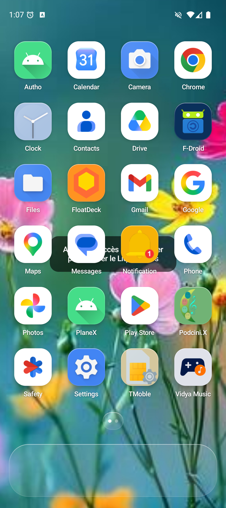
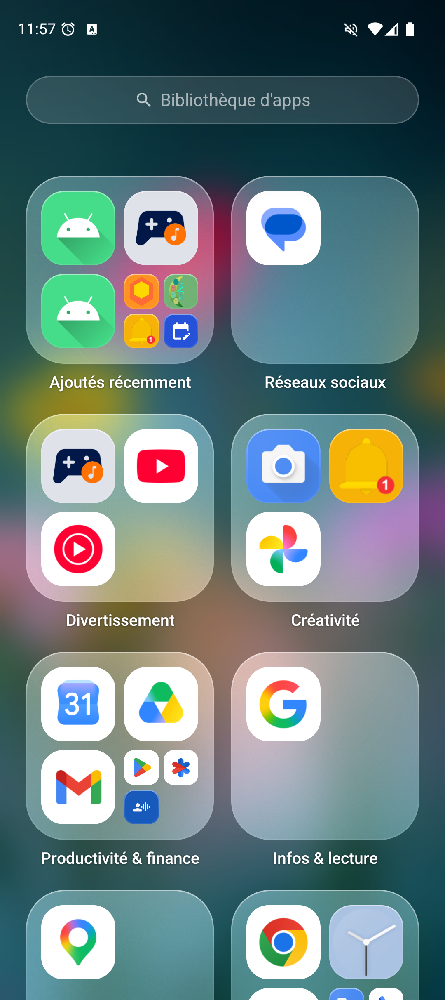
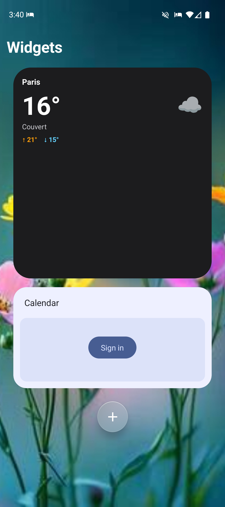

# Fruit OS Launcher Android

Un launcher Android au design épuré et fluide — grille d'apps, dock, dossiers, bibliothèque
d'apps, recherche, widgets, centre de contrôle et effets de verre (« Fruity Glass ») —
entièrement en **Jetpack Compose**.

## Captures

| Accueil | Bibliothèque d'apps | Widgets |
|---|---|---|
|  |  |  |

## Fonctionnalités

- **Écran d'accueil** : grille d'apps multi-pages (HorizontalPager), dock fixe, indicateur de pages.
- **Dossiers** : création par glisser-déposer (fusion par superposition avec délai *dwell*), ouverture plein écran, renommage.
- **Bibliothèque d'apps** : catégorisation automatique en dossiers, recherche, vue alphabétique.
- **Recherche (Spotlight)** : recherche d'apps (swipe vers le bas) avec suggestions basées sur l'usage.
- **Widgets** : page dédiée + widgets sur les pages d'accueil, redimensionnement et déplacement,
  plus des **widgets maison** (horloge analogique/numérique, météo Open-Meteo, cadre photo/diaporama).
- **Centre de contrôle** (swipe depuis le bas) : torche, volume, luminosité, rotation,
  lecteur média, raccourcis, panneaux de connectivité.
- **Effets de verre** (via [Haze](https://github.com/chrisbanes/haze)) : niveau, teinte, loupe et brillance configurables.
- **Styles d'icônes** : Défaut / Sombre / Teinté / Verre, + personnalisation **par app** (fond, teinte, luminosité, zoom).
- **Mode édition** (jiggle), badges de notification, détection install/désinstallation en temps réel.

## Stack technique

- **Kotlin** + **Jetpack Compose** (Material 3)
- **Haze** 1.7.2 — flou backdrop / effet verre
- **DataStore** — persistance de la disposition et des préférences
- `minSdk 31` (Android 12), `compileSdk 36`

## Construire depuis les sources

Prérequis : **JDK 21** et le SDK Android (via Android Studio ou en ligne de commande).

```bash
# Cloner
git clone <url-de-ton-dépôt>
cd <dossier-du-dépôt>

# Build debug + installation sur un appareil/émulateur connecté
./gradlew :app:installDebug

# Ou juste générer l'APK debug
./gradlew :app:assembleDebug
# → app/build/outputs/apk/debug/app-debug.apk
```

Pour une **release signée** (APK ou bundle) — par exemple à attacher à une *GitHub Release* —
voir [PUBLISHING.md](PUBLISHING.md).

Une fois installé, définis l'app comme launcher par défaut dans les réglages Android
(ou via le sélecteur d'accueil qui apparaît au bouton Home).

## Structure du projet

```
app/src/main/java/com/stanleycx/fruitos/
├── MainActivity.kt            # Activité unique (edge-to-edge, host de widgets)
├── data/                      # Modèles, repositories, persistance (layout, widgets, catégories)
├── ui/
│   ├── home/                  # Écran d'accueil, drag & drop, logique de grille (HomeScreen.kt)
│   ├── dock/                  # Dock
│   ├── library/               # Bibliothèque d'apps + dossiers de catégories
│   ├── spotlight/             # Recherche
│   ├── widget/                # Hôte de widgets, page widgets, picker, resize
│   ├── controlcenter/         # Centre de contrôle (contrôles système + UI verre)
│   ├── settings/              # Écrans de réglages (verre, teinte, loupe, style d'icônes…)
│   ├── components/            # AppIcon, Glass, IconStyle, indicateur de pages, etc.
│   └── theme/                 # Thème Compose
└── widget/                    # Widgets maison (horloge, météo, cadre photo) + providers
```

## Licence

[MIT](LICENSE) © 2026 stanleycx

## Avertissement

Projet **indépendant et non officiel**. Non affilié à, ni approuvé, ni sponsorisé par
Apple Inc. ou toute autre entreprise. Il s'inspire librement de l'esthétique des systèmes
mobiles modernes, mais n'embarque **aucune ressource propriétaire de tiers** (police, icône,
fond d'écran ou son) : les icônes affichées proviennent des applications installées sur
l'appareil, et la police est celle du système. Toutes les marques éventuellement citées
appartiennent à leurs détenteurs respectifs.
